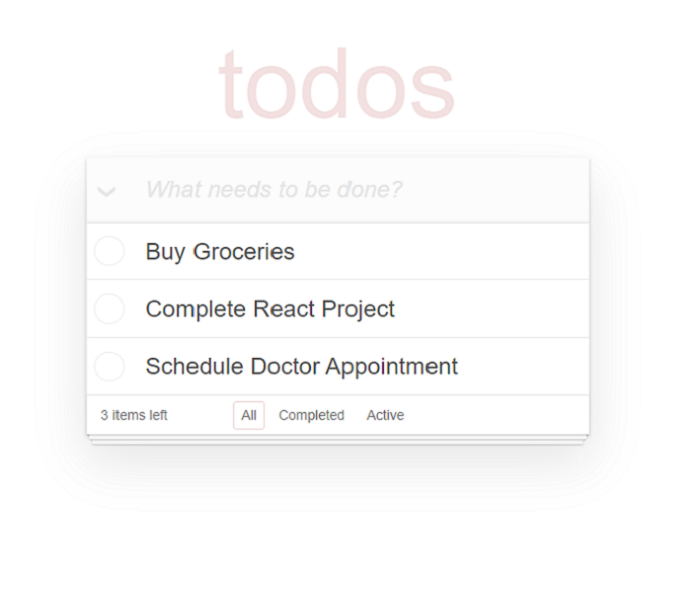
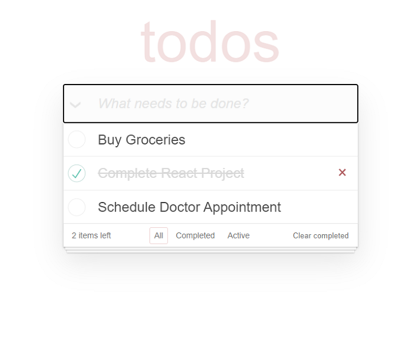

# Interactive To-Do List Application

This project is an interactive to-do list application. It allows users to add, edit, and remove tasks, providing a seamless way to manage daily activities. Built with React and TypeScript, the application ensures type safety and scalability, making the codebase robust and easy to maintain.

The app features dynamic task management, where users can mark tasks as completed or delete them entirely. The user interface is designed to be intuitive, offering a smooth experience across different devices. This project highlights my ability to create responsive and interactive applications using modern web development tools.

## Features

- Add, edit, and remove tasks
- Mark tasks as completed
- Responsive design for various devices

## Screenshots




## Demo

[Check out the live demo](https://yaroslav1177.github.io/todo-app/)

## Installation

To run this project locally:

1. Clone the repository
   ```bash

    git clone https://github.com/yaroslav1177/todo-app.git

2. Navigate to the project directory

    cd todo-app

3. Install dependencies

    npm install

4. Start the application

    npm start

## Technologies Used:

  - React
  - TypeScript
  - SCSS
